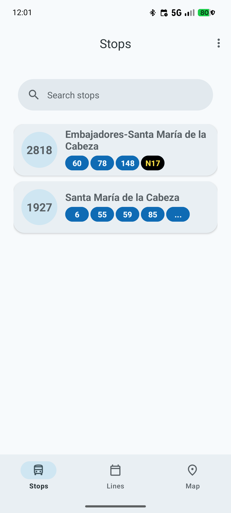
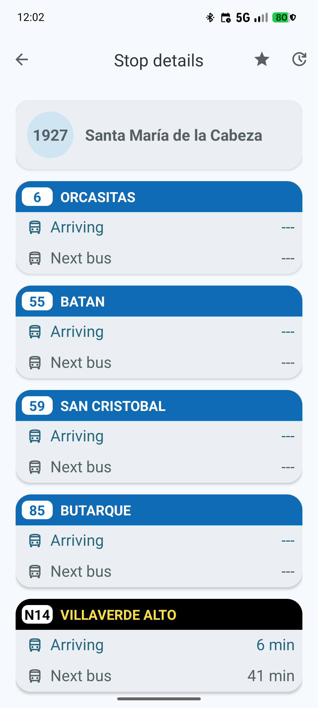
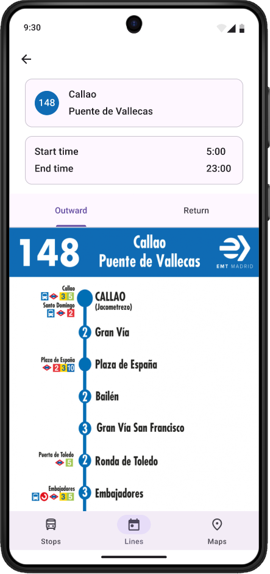

<image src="./docs/images/MadridBusLogo.png" height="150" />

<h1 align="center">Madrid Bus</h1>

**Madrid Bus** es la primera aplicación de software libre y codigo abierto encargada de ofrecerte la información en tiempo real sobre las horas de llegada de los buses, mapas de transporte público e información de horarios y rutas de las líneas de los buses de la EMT.

> [!WARNING]
> Este proyecto se encuentra en una fase de prototipado

## Características

|      Nombre      |                                   Descripción                                   |
|------------------|---------------------------------------------------------------------------------|
| **Paradas**      | Consulta información de la parada tales como el tiempo de llegada de los buses  |
| **Líneas**       | Consulta los horarios y rutas de los buses por línea                            |
| **Mapa**         | Mapa completo de transporte público de la *Comunidad de Madrid*                 |
| **Homogeneidad** | Cuenta con un tema basado en Material 3, sigiendo los colores de tu dispositivo |
| **Rapidez**      | Ofrece respuestas casi instantáneas sobre los resultados                        |

## Capturas

    
    
    

## Análisis del entorno

Si bien es cierto que existe una aplicación oficial de buses de la EMT esta tiene ciertos defectos que resultan molestos para los usuarios, ya sea a nivel de diseño, funcionalidad o flujo, lo que esta aplicación no es competir sino tratar de aportar con algo que sea visualmente atractivo e intuitivo para los usuarios.

### Requisitos

Utilizaremos unas cuantas APIs, siendo la primera y principal la que toca utilizar una clave/token para poder utilizarla, las demas son mas sencillas ya que no requieren de token para poder acceder a ellas, si es de carácter obligatorio el uso o implemento de una base de datos recurriremos a ella solamente para administrar las paradas favoritas del usuario.

**Requisitos de usuario**

- Dispositivo móvil con Android
- Conexión a Internet
- 128mb de almacenamiento libres

## Público objetivo

Esta aplicación está dirigida específicamente para las personas que utilizan el transporte público (Buses) en la Comunidad de Madrid, ya sea que lo usen frecuentemente o casualmente.

## Diseño

### Colores

Utilizaremos como tema de colores principal Material You, y los colores representativos de la EMT, para que la aplicación se adapte al teléfono del usuario, pero también utilizaremos varios colores forzados correspondientes a la paleta de colores establecida por la EMT, es decir, azul marino, azul celeste y amarillo.

| Color | Hex |
|---|---|
|  **Azúl marino** | `#0f6bb4` |
|  **Turquesa oscuro** | `#00adcf` |
|  **Amarillo dorado** | `#f8dd43` |

### Sentido

Decidimos usar esta la gama de colores, ya que son los colores que utiliza la EMT y así los usuarios no se confundan al momento de buscar sus buses o paradas, además del diseño principal de Material You y lo que hace es que el diseño sea adaptable al teléfono.

### Tipografía

Usamos la tipografía predeterminada de Android, específicamente [**Roboto**](https://fonts.google.com/specimen/Roboto), siguiendo las guías de diseño de **Material 3**, para homogeneizar nuestra aplicación en el entorno Android.

### Componentes y diseño general

Todas las ventanas/pestañas de nuestra aplicación cuentan con un diseño de los componentes redondo esto para brindar una sensación de comodidad a nuestros usuarios a la hora de utilizar la app por un bastante tiempo, además de que le da una estilo de pulidez a la misma interfaz.

## Historias de usuario

Como usuarios de la aplicación Madrid Bus, queremos facilitar a los ciudadanos de la Comunidad de Madrid el acceso a la información sobre la llegada de los autobuses a una parada específica, ya sea buscándola por nombre, por código o accediendo a las paradas marcadas como favoritas, con el fin de obtener rápidamente los tiempos de llegada y planificar mejor sus desplazamientos.

## Diagrama de flujo

<image src="./docs/images/diagram.png"/>

## Arquitectura

### Estructura general

**Cliente**

- interfaz con la que interactúa el usuario.
- Mostrar información de forma clara e intuitiva
- Gestionar la navegación entre pantallas
- Enviar solicitud a las Apis 
- Procesar y presentar los datos

**Servidor**
    
- Proporciona información en tiempo real sobre.
- Paradas de autobuses
- Líneas disponibles
- Tiempo estimado de llegada

**Base de datos local**

- Se utiliza una base de datos local en el dispositivo para almacenar.
- Paradas favoritas

### Flujo de comunicación

- El usuario realiza una acción(Búsqueda de la  parada)
- La aplicación realiza una petición a la API de la EMT
- La API procesa la información y devuelve la información correspondiente
- La aplicación recibe los datos, los procesa y los muestra en la interfaz

### Modelo ER

**Parada**

- id_parada
- Nombre
- ubicación 
- Líneas asociadas

**Línea**

- id_linea
- Nombre 
- Destino

**Llegada**

- id_llegada
- Tiempo estimado
- id_parada
- id_linea

**Favorito**

- id_favorito
- id_parada
- id_linea

### Diagrama

<image src="./docs/images/diagram2.png"/>

## Licencia

Licenciado bajo la licencia [GPLv3](https://www.gnu.org/licenses/gpl-3.0.en.html).