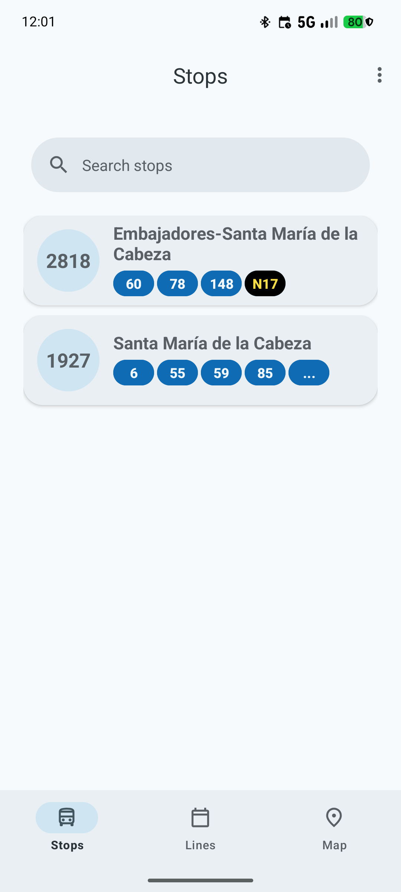
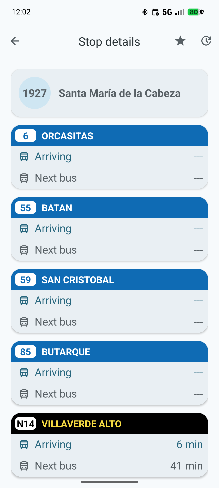
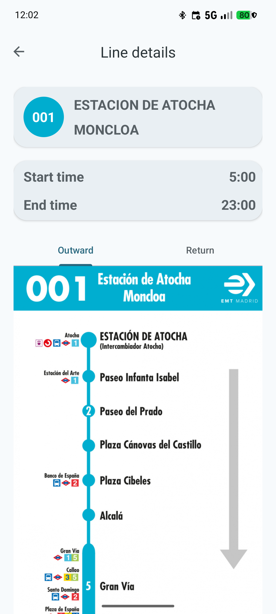

<image src="./docs/images/logo.png" height="150" />

<h1 align="center">Madrid Libre Transport</h1>

**Madrid Libre Transport** is an open source Android app that offers real time information about EMT buses arriving time, lines information and routes of these lines.

## Features

| Name       | Description                                                             |
|------------|-------------------------------------------------------------------------|
| **Stops**  | Checks stop information such as bus arrival times                       |
| **Lines**  | Checks bus schedules and routes by line                                 |
| **Maps**   | Complete public transportation map of the *Community of Madrid*         |
| **Design** | It has a theme based on Material 3, matching the colors of your device. |

## Screenshots

    
    
    

## Requirements

- A device with Android
- Internet connexion
- At least 210mb of free space

## Design

It uses Material 3 as main theme, but there are also hard-coded colors based on EMT's colors.

| Color                                                                                                        | Hex       |
|--------------------------------------------------------------------------------------------------------------|-----------|
|  **EMT blue**             | `#0072ce` |
|  **Madrid 360 blue** | `#00aecf` |
|  **Light blue**      | `#7bb7e9` |
|  **Golden yellow**        | `#f8dd43` |
|  **Yellow**             | `#ede939` |
|  **Brown**               | `#764709` |

## License

Licensed under the [GPLv3](https://www.gnu.org/licenses/gpl-3.0.en.html) license.